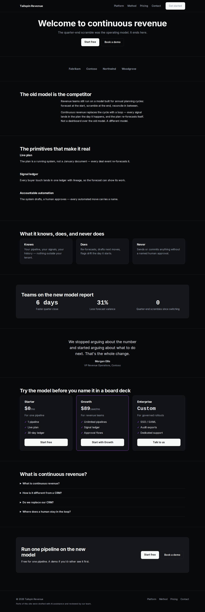

# t2d3-site-template-challenger

**Challenger** — a benchmark-derived B2B SaaS website starter template (category creator × high-velocity dark).
A precision-dark site that names a new category and proves it with the product, one scroll at a time.



One of five starter templates behind the [T2D3 OS](https://www.t2d3.pro) Website
Builder: the app turns a company's locked go-to-market foundation (ICP,
personas, value props, brand) into a complete site spec, and this template
renders it — the architecture is reviewed once, every build only fills
content. Derived from a benchmark study of 75 top sub-$100M-ARR SaaS sites:
patterns and roles, never any single site's copy or trade dress.

Canonical source: `site-templates/challenger/` in the `t2d3-playbook-app` monorepo
(this repo is a read-only mirror, synced on release).

Identical architecture and section contract to `t2d3-site-template-utility`
(see its README for the fill-content flow). This template differs in SKIN and
register: Precision dark: near-black canvas (#08090A), sub-pixel borders, off-white ink, ambient indigo accent. Signature: the /method category-101 page with the old-way/new-way comparison table.

## Run the sample

```bash
npm install
npm run dev
```
